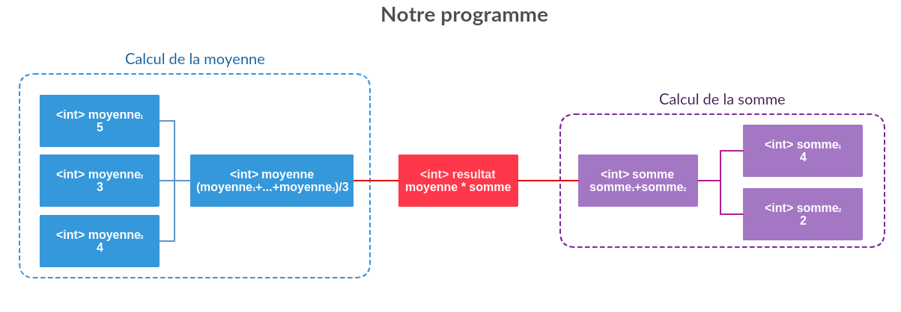

# Que sont les variables ?  

**Les variables** permettent de stocker des données dans notre programme. Elles sont placées dans la mémoire vive et doivent être **déclarées** (crées) avant de pouvoir être utilisées.

Pour cela, elles ont besoin des plusieurs caractéristiques :
  * un **nom** : un nom sous lequel elle sera accessible dans notre code.
  * un **type** : il définit ce que la variable peut contenir (maximum, minimum, sa taille etc...). Le système d'exploitation alloue une partie de la mémoire vive différente en fonction des types utilisés donc veillez à **bien choisir le type** de variable.
  * une **valeur** : c'est le contenu de la variable, elle peut varier en fonction du temps si elle n'est pas déclarée [constantes](#constante)
  * une **portée** : c'est la portion de code (la zone de code) où elle est utilisable
  * une **visibilité** : ce sont les règles qui fixent qui a accès à cette variable (qui peut la voir et l'utiliser. ex: uniquement la méthode, la classe, le package, tout le projet...)

> **[danger] Attention**
>
> La **portée** et la **visibilité** sont deux choses bien **distinctes** malgrè qu'elles soient liées. Beaucoup de personnes ne percoivent pas la nuance mais elle est bien présente.

Si on défini une variable ainsi :  

  

Imaginons un programme ainsi :  

  

> **[info] Info**
>
> Ici, **int** est le **type de variable**. Il s'agit d'un **nombre entier**.  

### Description  

Notre programme est composé de **3 parties** :
  * Calcul de la moyenne
  * Calcul de la somme
  * Calcul du produit des deux

Les variables de la **moyenne** ont une portée et une visibilité qui est la zone bleue. Les variables de la **somme** ont une portée et une visibilité qui est la zone violette. Elle sont ni visibles, ni accessibles de l'extérieur.   
Les portées sont dit de la méthode car les variables peuvent être détruites une fois le calcul effectué.  
Mais, nous avons deux exeptions ! _**resultat**_ peut voit les valeurs _**moyenne**_ et _**somme**_. On a changé leurs visibilités pour qu'elles soit accessibles dans le reste du programme.  

## Déclarations

On déclare une variable ainsi :

```
<Type de la variable> <Nom de la variable> = <Valeur de la variable>;
```
ce qui donne dans le code :

```java
int entier = 42; // Notre variable de type int contient la valeur 42.
```  
  

Le point-virgule signifie **la fin d'un instruction**. Nous les reverrons plus tard.

> **[danger] Attention**
>
> Une variable de type **XYZ** ne peux contenir que des données de type **XYZ**.

## Prémitives  
Les variables dites **primitives** sont des type de données simples que l'on retrouve dans presque tous les autres langages de programmation.
Elles peuvent être des nombres, un booléen ou un caractère Unicode.  
A partir de celles-ci, on crée d'autre variables : **les Objets**.

Java possède [**8 primitive datatypes**](https://docs.oracle.com/javase/tutorial/java/nutsandbolts/datatypes.html) par défaut. On les appelle les **Primitive Data Types** (ou juste Primitive).  

### Entiers  

| Type de variable | Définition | Minimum | Maximum | Valeur par défaut | Utilité |
| ---------------- | ----------- | ------- | ------- | ----------------- | ------- |
| byte | Un entier sur 8-bit signé (1 octet)| -128 (-2^7) | +127 (inclusif) (2^7 - 1) | 0 | byte est utilisé pour économiser de l'espace, principalement à la place des entiers, car un octet est quatre fois plus petit qu'un entier. |
| short | Un entier sur 16-bit signé (2 octets) | -32,768 (-2^15) | +32,767 (inclusif) (2^15 -1) | 0 | short est aussi utilisé pour économiser de l'espace. Il est deux fois plus petit qu'un entier. |
| int | Un entier sur 32-bit signé (4 octets)  | -2,147,483,648 (-2^31) | +2,147,483,647 (inclusif) (2^31 -1)  | 0  | int (Integer) est utilisé très généralement pour manipuler des entiers sans se soucier de la mémoire.  |
| long | Un entier sur 64-bit signé (8 octets)  | -9,223,372,036,854,775,808 (-2^63) | +9,223,372,036,854,775,807 (inclusif) (2^63 -1) | 0L  | long a la plus grande plage d'entiers possible. Il est utilisé quand on a besoin d'entiers extrêmement grands. |  

### Nombres réels

| Type de variable | Définition | Minimum | Maximum | Valeur par défaut | Utilité |
| ---------------- | ----------- | ------- | ------- | ----------------- | ------- |
| float | Un nombre réel simple une sur avec [précision simple](https://en.wikipedia.org/wiki/Single-precision_floating-point_format) sur 32-bits [IEEE 754 floating point](https://en.wikipedia.org/wiki/Single-precision_floating-point_format#IEEE_754_single-precision_binary_floating-point_format:_binary32)| Na | | Na | 0.0f | float est utilisé pour des calculs nécessitant une grande précision comme la devise. Il permet aussi d'économiser de l'espace. |
| double | Un nombre réel double une avec [précision double](https://en.wikipedia.org/wiki/Single-precision_floating-point_format) sur 64-bits [IEEE 754 floating point](https://en.wikipedia.org/wiki/Single-precision_floating-point_format#IEEE_754_single-precision_binary_floating-point_format:_binary32)| Na | | Na | 0.0d | double est utilisé pour des calculs ne nécessitant pas une très grande précision. Il souvent le choix par defaut |

### Autres  

| Type de variable | Définition | Minimum | Maximum | Valeur par défaut | Utilité |
| ---------------- | ----------- | ------- | ------- | ----------------- | ------- |
| boolean | Une information sur 1 bit. Accepte uniquement **true** ou **false** | Na | Na | false | boolean est utilisé dans des conditions simples |
| char | Un caractère Unicode 16-bit. | '\u0000' (ou 0) | '\uffff' (ou 65,535) | Na | char est utilisé pour stoqué n'importe quel caractère (lettres, chiffres, % ou encore ❤)|

## Objets  
Les Objets sont des types de données plus complexes.

## Constantes

## References
