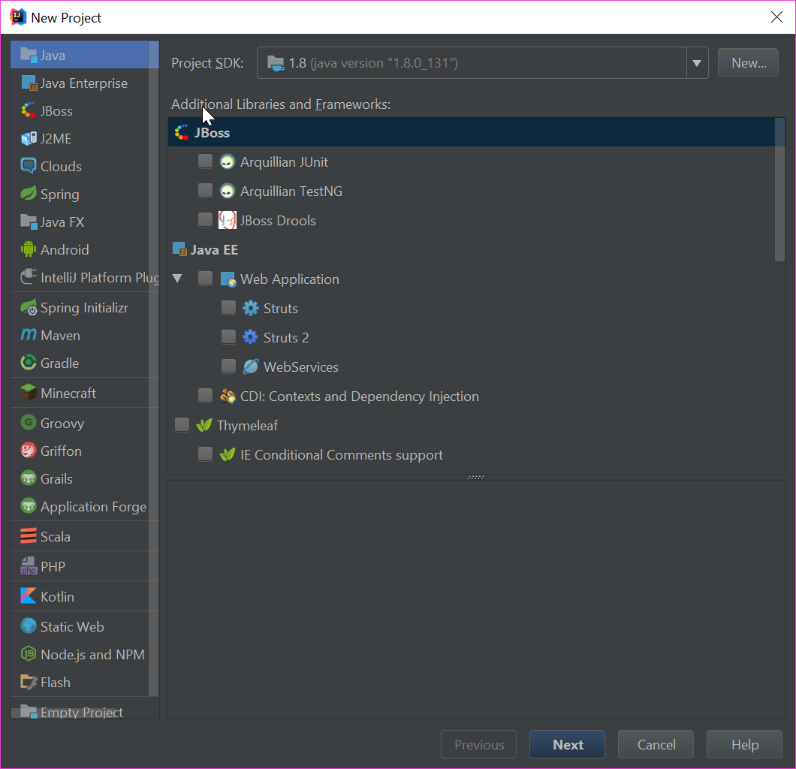
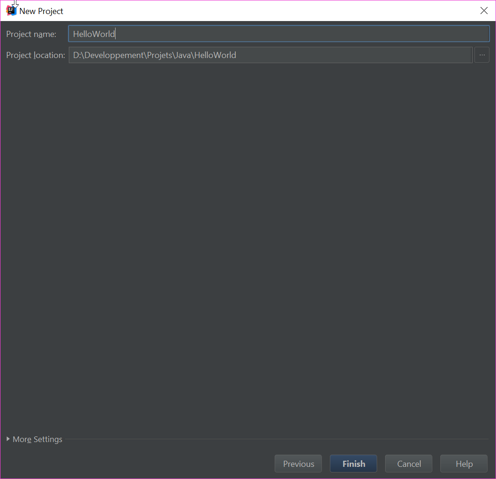
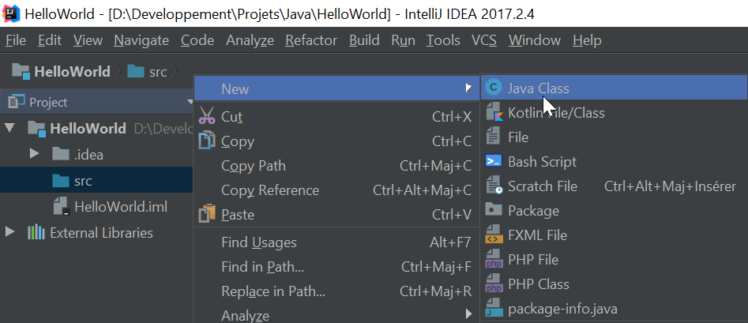
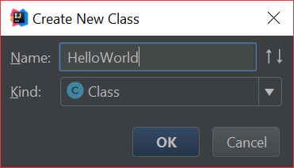
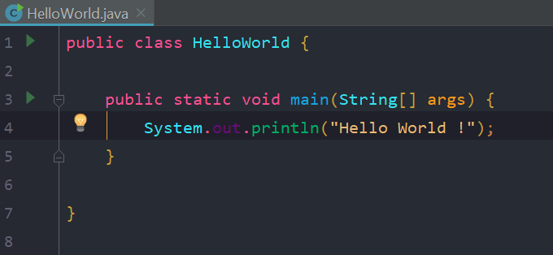
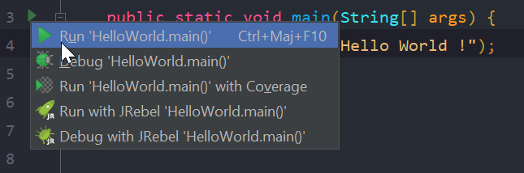
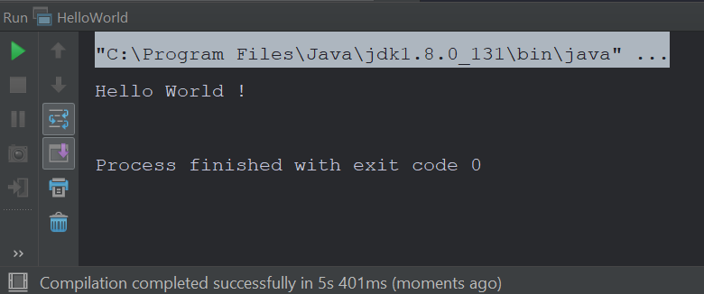

## Hello World {#helloworld}

En informatique, **Hello world** (traduit littéralement par « bonjour le monde ») sont les mots écrits dans un programme informatique **simple** dont le but est d'en faire la **démonstration**.
Autrement dit, ce sera notre **tout premier programme** dont le but sera de nous dire bonjour !

Lancez IntelliJ et cliquez sur « **Create New Project** ».


Choisissez **Java** et cliquez sur **Next**.



Cliquez une nouvelle fois sur **Next** puis entrez un nom et un endroit pour sauvegarder votre projet. Je l'appelle pour ma part **HelloWorld**. 



> Il est important de noter que votre « **Project location** » **ne doit pas contenir** autre chose que **des lettres, des chiffres et des espaces**.
> Autrement cela pose quelques bugs à l'IDE.

Cliquez sur **Finish** et patientez le temps de chargement.

Une nouvelle fenêtre va s'ouvrir. Elle contient **la structure du projet** à gauche et **l'éditeur de texte** à droite.
Faites un **clique droit** sur le dossier bleu "src" et **créer une nouvelle classe**.



Entrez « **HelloWorld** » comme nom et vérifier que le type soit bien **Class**.



#### HelloWorld.java
Dans **l'éditeur de texte** (à droite), remplace tout le contenu par celui-ci:

Votre fichier doit ressembler à ceci:




```java
public class HelloWorld {

    public static void main(String[] args) {
        System.out.println("Hello World !");
    }

}
```


Cliquez sur la petite flèche verte à gauche du numéro des lignes et séléctionnez « **Run 'HelloWorld.main()'** ».



### Sortie console
Une fenêtre s'ouvre en bas et vous affiche « Hello World ! ».



**Félicitation**, vous venez de **créer, compiler et éxécuter** votre **premier** programme !