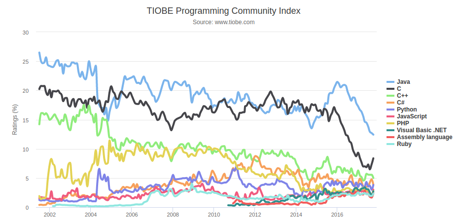
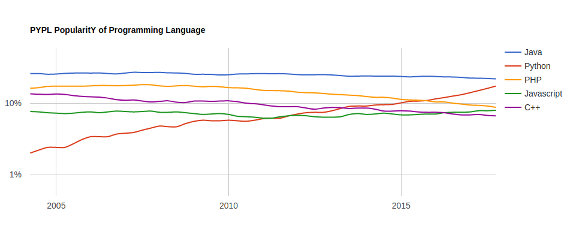

# Introduction à Java

## Un tour d'horizon

Pour commencer en beauté, je vous propose de définir « **Java** ».

Java est un **langage de programmation**[^1] développé initialement par **Sun Microsystems** \(aujourd’hui racheté par **Oracle**\).

Java c’est plus de **10 millions** **de développeurs** à travers le monde, quelques **3 milliards de dispositifs** pouvant le mettre en œuvre. Il est présent chez plus de **97% des entreprises** dont Google, Facebook et bien d’autre.  

En 2016, Java était le langage **le plus demandé** à hauteur de 28%. Il permet de réaliser énormément de choses bien différentes: des applications pour mobile comme **Android** \(le Playstore est composé à 80% d’application écrite avec Java\), des logiciels, des jeux-vidéos, des utilitaires et bien d'autres, comme le dit si bien [www.java.com](https://www.java.com) :

> La technologie Java vous permet de travailler et de vous divertir dans un environnement informatique sécurisé. \[...\]
>
> Java permet de jouer en ligne, de discuter avec des internautes du monde entier, de calculer les intérêts de vos prêts ou de visualiser des images en 3D, pour ne citer que ces exemples.  

On peut noter qu'il a la deuxième plus grande popularité en 2016.

## Pourquoi Java ?

Java est un **langage parfait** pour une première fois :

* Il est **fortement typé.** Vous **savez** avec quel type de donées vous travailler.
* Il gère la mémoire **tout seul.** Presque aucun risque de tout casser ! \(les poiteurs ? je ne connais pas\)
* Il est **portable**, **indépendant** de toute plate-forme. Un code pour Windows, MacOS, Linux... ce n'est pas beau ?
* Il est **multitâches**.
* Il est **simple**. Chaque ligne peut être traduite littéralement pour en comprendre le sens.

Java est l'un des **meilleurs langages** pour débuter. Nous reverrons en détails chacun de ses points de manière plus précise un peu plus tard.  
Voici quelques chiffres concernant sa popularité :  

Comme on le voit, Java est **très populaire**. Cela s'explique par le fait qu'il est relativement **simple** d'utilisation.

[^1]: Les langages de programmation permettent de définir les ensembles d'instructions effectuées par l'ordinateur lors de l'exécution d'un programme.
