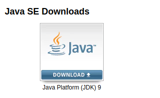
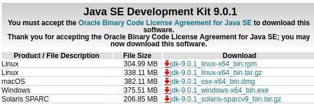

# JDK et JRE

La **portabilité** de Java réside dans sa **machine virtuelle** : elle assure qu’un programme Java sera utilisable avec **tous les systèmes** où elle est installée. C’est en quelques sortes un logiciel qui nous permet, grâce à un stade intermédiaire appelé « ** bytecode** » , d’exécuter nos programmes sans devoir les recompiler.

Le **bytecode** c'est « le langage que parle la JVM[^1] » : Il est obtenu à partir du **code source** \(listes d'instructions lisibles par le développeur\) en passant dans un **compilateur** \(qui le transforme en instructions lisibles par la JVM\).

> [_En savoir plus_](/jvm/jvm.md)_ sur la machine virtuelle Java._

La différence entre JDK et JRE se présente de la façon suivante :

* Le **JRE** \(Java Runtime Environment ou l’Environnement d’exécution Java\) est la **Machine Virtuelle Java**. C’est ici que le programme **s’exécute**.

* Le **JDK** \(Java Development Kit ou Kit de développement Java\) est quant à lui **l’ensemble des outils** pour **créer et compiler** nos logiciels incluant le JRE, le compilateur, des outils tel que les JavaDocs \(Documentations Java\), le Java Debugger etc…

## Installation

Aujoud'hui la plupart des IDEs dont nous verrons la définition plus tard **intègrent** leurs propres JRE. Pas besoin de le télécharger donc ! En revanche, il nous faudra le JDK afin de compiler nos programmmes.  
Pour cela, téléchargez-le sur [le site de Java](http://www.oracle.com/technetwork/java/javase/downloads/index.html).

Cliquez sur **Download** :
  

Séléctionner la version pour votre système d'exploitation et **installer-la**.

> **[info] Notes**
>
> Vous pouvez l'installer directement depuis les dépots si vous avez une machine unix.

[^1]: Java Virtual Machine ou Machine Virtuelle Java en français
